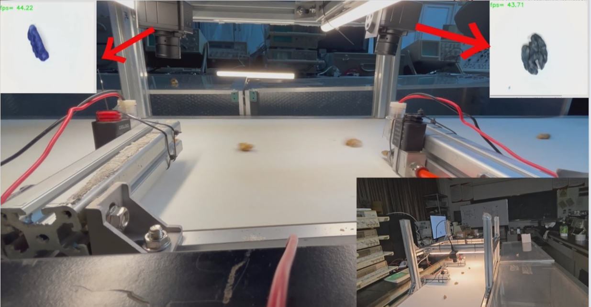

# 🌰 AI核桃仁智能分选系统

[](https://github.com/dabingbigice/kust-seg-hutao)
[](https://www.python.org/)
[](https://pytorch.org/)

> ### **基于深度学习的核桃仁动态分选系统 | 昆明理工大学现代农业工程学院**
>
> 

## 📖 项目概述

针对云南核桃产业人工分选效率低、成本高的痛点，本系统创新性集成：

- 🖥️ ​**改进DeepLabv3+模型**​（22.4M参数量）
- 🏭 ​**工业级动态分选架构**​（0.5m/s传送带速度）
- 💨 ​**气动柔性分选技术**​（0.4-0.6kPa无损喷射）

## 🤖系统实物图

## 现场作业图

## 🚀 核心功能

| 模块         | 技术指标        | 创新点                |
| ------------ | --------------- | --------------------- |
| **视觉系统**​ | 25ms/帧处理速度 | MobileNetV2轻量化改造 |
| **分选系统**​ | 91.42%准确率    | 双摄像头协同决策      |
| **控制系统**​ | ≤10ms响应延迟   | STM32F103精准时序控制 |

## 🛠️ 技术亮点

### 🌟 三重技术革新

```python
# 示例代码片段
 def update_frame(self):
        """强制缩放画面到512x512像素"""
        frame0 = shared_photo_frame_0.get(timeout=5)
        ret0 = shared_photo_ret_0.get(timeout=5)
        self.window_detect(ret0, frame0, 7, self.label, 'rxd1')
        t2 = time.time()
        print(f'cap0摄像头处理图片时间:{(t2 - t1) * 1000}ms')
        print(f'-----------------------------------------------------------------------')

        t3 = time.time()
        frame1 = shared_photo_frame_1.get(timeout=5)
        ret1 = shared_photo_ret_1.get(timeout=5)
        self.window_detect(ret1, frame1, 4, self.child_winodw.labelchild, 'rxd2')
        t4 = time.time()
        print(f'cap1摄像头处理图片时间:{(t4 - t3) * 1000}ms')
        print(f'-----------------------------------------------------------------------')

```


### 📊 性能表现

- **动态分选准确率**: 91.42% ✅
- **漏检率**: <2.7% ⚡
- **处理速度**: 40FPS 🚀
- **分选效率**: 100g/min（≈2人工作量）👥

### 🎨硬件配置

| 组件         | 型号      | 关键参数        |
| ------------ | --------- | --------------- |
| **工业相机**​ | LT-USB5MP | 500万像素/30FPS |
| **主控芯片**​ | STM32F103 | 72MHz Cortex-M3 |
| **空压机**​   | OTS-800   | 0.7Mpa输出压力  |

### 🌍 应用前景

- 短期: 投入资金提升现有产品效率替代云南核桃主产区人工分选
- 中期: 扩展至巴旦木/中药材分选

### 📦 安装部署

#### 硬件搭建

- 🔩 组装螺旋送料器与PU传送带
- 📸 安装工业相机（垂直高度30cm）
- ⚡ 连接STM32控制器与气动阀门
- ➡️ 视频演示  https://pan.baidu.com/s/1_AC_rG8YYO8vLc5EAFuEQg?pwd=feei 提取码: feei 

### 软件
- **操作系统**​：Windows 11
- **编程语言**​：Python 3.8
- **框架**​：PyTorch 2.3.1，CUDA 11.8
- **模型**​：优化的 DeepLabv3+，使用 MobileNetV2 解码器
- **库**​：OpenCV，PyQt 用于图形界面

### 软件设置
```bash
# 克隆仓库
git clone -b master https://github.com/dabingbigice/kust-seg-hutao.git
cd kust-seg-hutao

# 安装依赖
pip install -r requirements.txt
# (requirements.txt 需包含 PyTorch、CUDA、OpenCV、PyQt 等)

# 运行应用程序
python gui/index.py
```