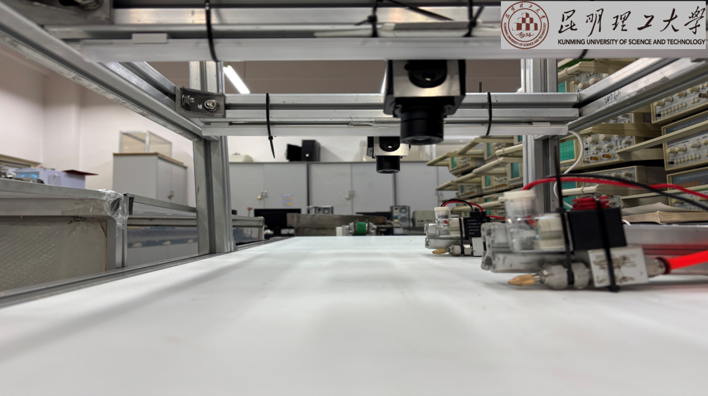
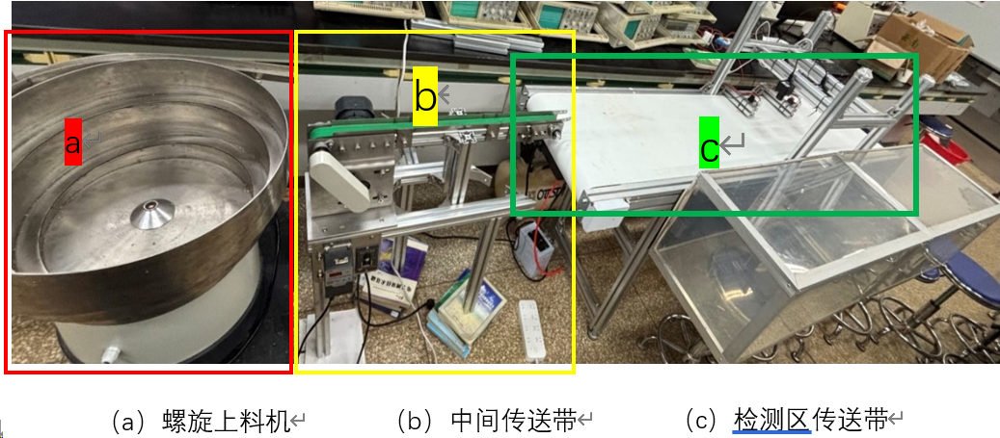
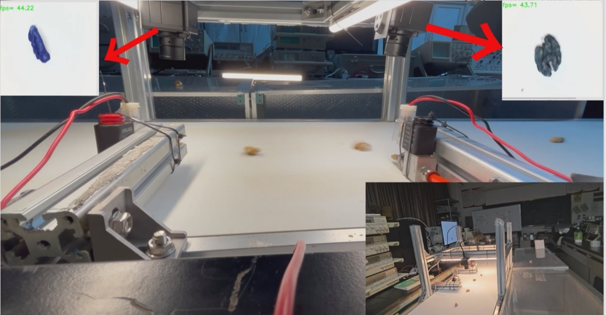

# 🌰 AI Walnut Kernel Intelligent Sorting System

[](https://github.com/dabingbigice/kust-seg-hutao)
[](https://www.python.org/)
[](https://pytorch.org/)

> ### ​**Deep Learning-based Dynamic Sorting System | School of Modern Agricultural Engineering, KMUST**​
> 
> 

## 📖 Project Overview
A revolutionary solution for Yunnan walnut industry featuring:
- 🖥️ ​**Enhanced DeepLabv3+​**​ (22.4M parameters)
- 🏭 ​**Industrial Dynamic Sorting**​ (0.5m/s conveyor speed)
- 💨 ​**Pneumatic Flexible Sorting**​ (0.4-0.6kPa non-destructive)

## 🤖 System Prototype


## 🏭 Live Operation


## 🚀 Core Features

| Module         | Technical Specs       | Innovations               |
|----------------|-----------------------|---------------------------|
| ​**Vision**​     | 25ms/frame processing | MobileNetV2 optimization  |
| ​**Sorting**​    | 91.42% accuracy       | Dual-camera coordination  |
| ​**Control**​    | ≤10ms response        | STM32F103 precision timing|

## 🛠️ Technical Highlights

### 🌟 Triple Innovation

```python
# Code snippet
def update_frame(self):
    """Frame scaling to 512x512 pixels"""
    frame0 = shared_photo_frame_0.get(timeout=5)
    ret0 = shared_photo_ret_0.get(timeout=5)
    self.window_detect(ret0, frame0, 7, self.label, 'rxd1')
    t2 = time.time()
    print(f'Camera0 processing: {(t2 - t1)*1000}ms')
    
    t3 = time.time()
    frame1 = shared_photo_frame_1.get(timeout=5)
    ret1 = shared_photo_ret_1.get(timeout=5)
    self.window_detect(ret1, frame1, 4, self.child_winodw.labelchild, 'rxd2')
    t4 = time.time()
    print(f'Camera1 processing: {(t4 - t3)*1000}ms')
# 
```


### 📊 Performance

- Sorting Accuracy: 91.42% ✅
- ​Miss Rate: <2.7% ⚡
- ​Processing Speed: 40FPS 🚀
- ​Throughput: 100g/min (≈2 workers) 👥

### 🎨硬件配置

| Component         | Model      | Key Parameters |
| ------------ | --------- |----------------|
| **​Industrial Camera**​ | LT-USB5MP | 5MP/30FPS               |
| **MCU**​ | STM32F103 | 72MHz Cortex-M3 |
| **​Air Compressor**​   | OTS-800   | 0.7Mpa output     |

### 🌍 应用前景

- Short-term: Deploy in Yunnan walnut facilities
- ​Mid-term: Expand to almond/herbal sorting

### 📦  Installation

#### Hardware Setup

- 🔩 Assemble spiral feeder & PU conveyor
- 📸 Install camera (30cm height)
- ⚡ Connect STM32 & pneumatic valves
- ➡️ Demo video  https://pan.baidu.com/s/1_AC_rG8YYO8vLc5EAFuEQg?pwd=feei 提取码: feei 

### Software Stack
- ​OS: Windows 11
- ​Language: Python 3.8
- ​Framework: PyTorch 2.3.1 + CUDA 11.8
- ​Model: Optimized DeepLabv3+ with MobileNetV2
- ​Libraries: OpenCV, PyQt GUI
# Clone repo
git clone -b master https://github.com/dabingbigice/kust-seg-hutao.git
cd kust-seg-hutao

# Install dependencies
pip install -r requirements.txt

# Launch application
python gui/index.py